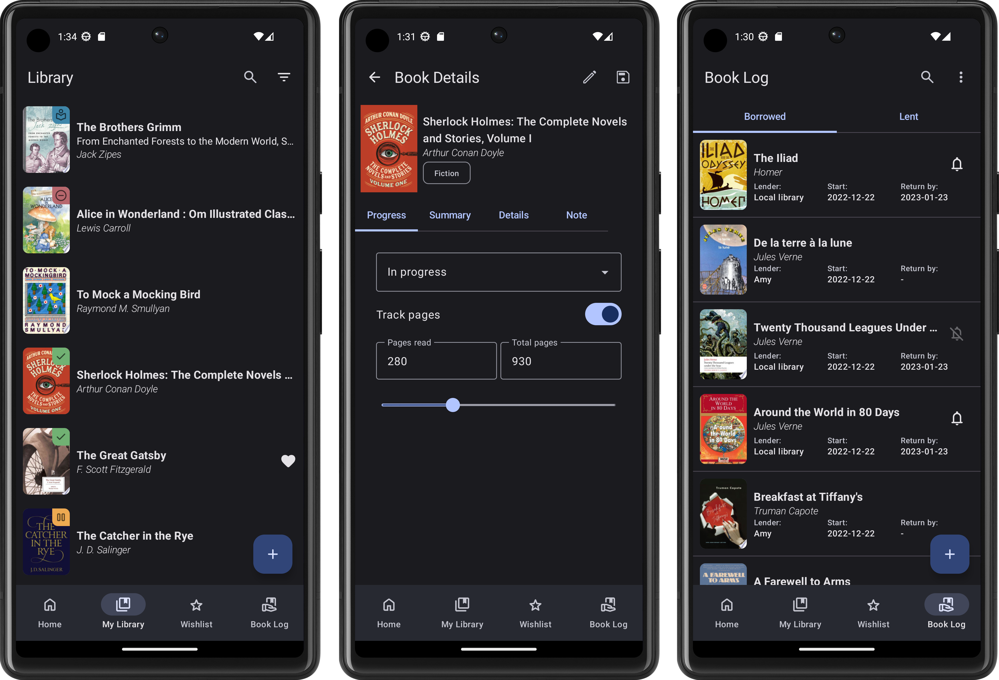

# PocketLibrary
Android app for managing your personal library. It lets you scan the barcode of any book, and it will automatically fetch the book data through the Google Books API.

## Features
* Mulltiple ways to add a book to your collection:
  * Scan the ISBN barcode (or insert the number maually)
  * Search it in the Google Books database
  * Add it manually
* Keep track of your reading progress: you can mark books as read, in progress, suspended or DNF (Did Not Finish)
* Keep record of the books you have borrowed from libraries and the books that you have lent to your friends
* Add a book to your wishlist by simply scanning its code, and you will also know if you already have it in your collection
* Multiple screen resolutions supported, from small phones to tablets
* Take a photo of a book cover and easily crop it, if it's not already present in Google databases
* Backup your book covers on Google Drive
* Currently supported languages: English and Italian

## Technical description
- App written in Kotlin
- UI created with Jetpack Compose, following the Material You design specifications and libraries
- If the selected app language is not English, the genres fetched with Google API are automatically translated
- Barcode scanner and genre translation implemented with Google ML Kit
- Data is saved locally in a SQLite database through the Room library
- Book metadata fetched with Google Books API

## Planned Features
- Data backup via Google Play 
